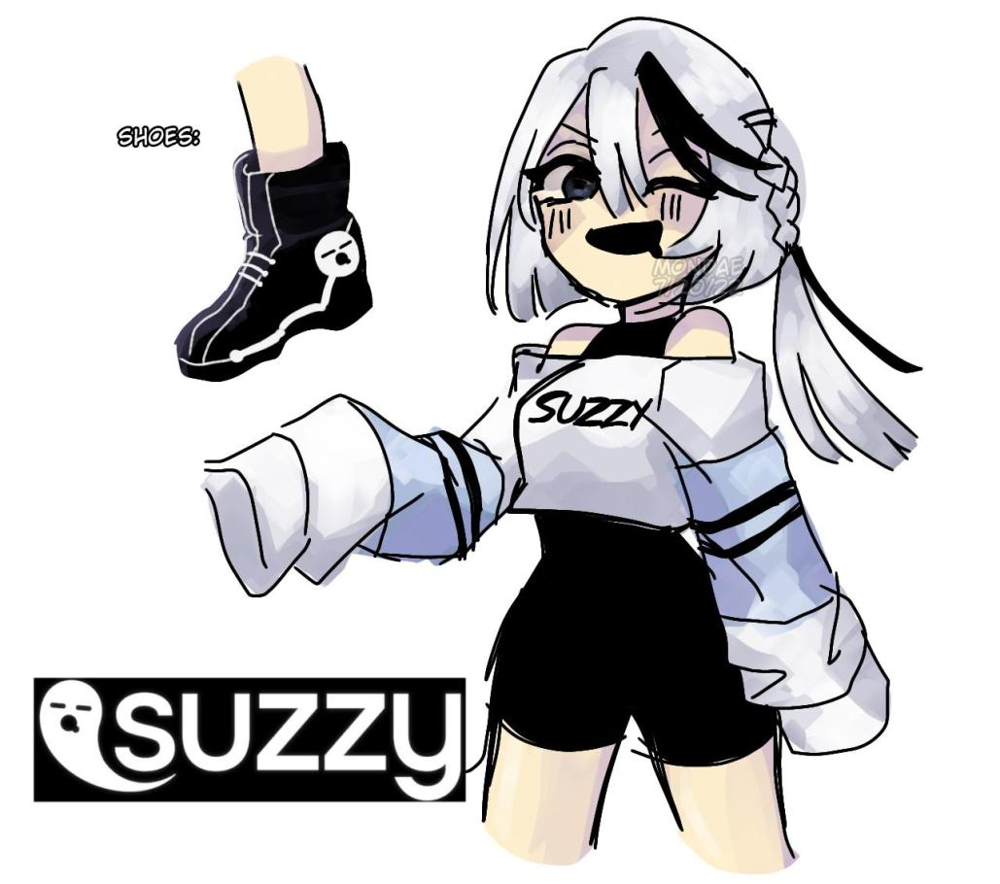
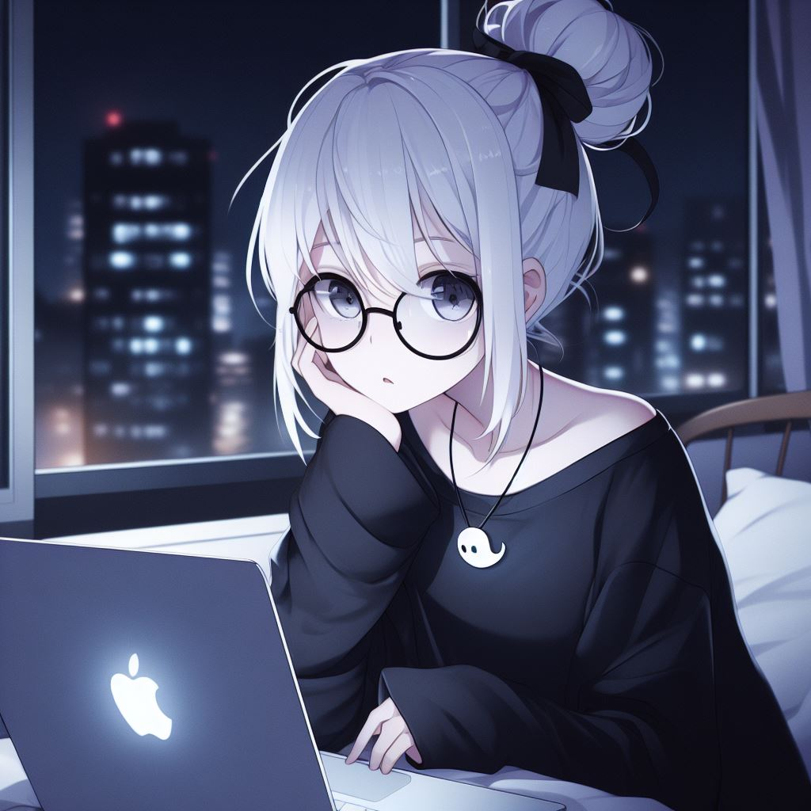

# 🤖 tools-suzie
A bot that manages the [ROBLOX Group](https://www.roblox.com/groups/10781692) and the Community Discord ~~(eventually)~~. 

> 🛈 This tool is for internal use only. No contributions are being accepted and documentation is not provided.

- [🤖 tools-suzie](#-tools-suzie)
- [🏐 ROBLOX Automation](#-roblox-automation)
    - [👥 Role Awards](#-role-awards)
- [👻 Mascots and Lore](#-mascots-and-lore)

<br>

# 🏐 ROBLOX Automation

### 👥 Role Awards
```
Group Members are awarded roles depending on their amount of badges collected in-game.
Please keep in mind that this is purely for fun and roles provides no in-game benefits.

🛈 There are currently 11 badges across 1 game

• 🌀 Recruit [0 Badges]
• ❄️ Beginner [2 Badges or 20%]
• 💧 Intermediate [5 Badges or 50%]
• 🔥 Professional [8 Badges or 80%]
• 💯 Completionist [11 Badges or 100%]

The following roles are unobtainable; please do not ask for these:
• 💼 Founder: Generous people who have donated to us
• 🐞 Bug Hunter: Found and reported numerous bugs
• 🌟 V.I.P: Reserved for special people
```

<br>

# 👻 Mascots and Lore
Suzie is one of the original mascots ~~(or waifus)~~ for suzzy games. 
Canonically she's an office lady and Boo *(ghost in the suzzy logo)* is the CEO.

*btw this was all Dakota's Idea, he dropped this in my DMs one day and it's canon now so enjoy.*




> 🛈 Character design and art by [@mondaeakari](https://twitter.com/MondaeAkari)